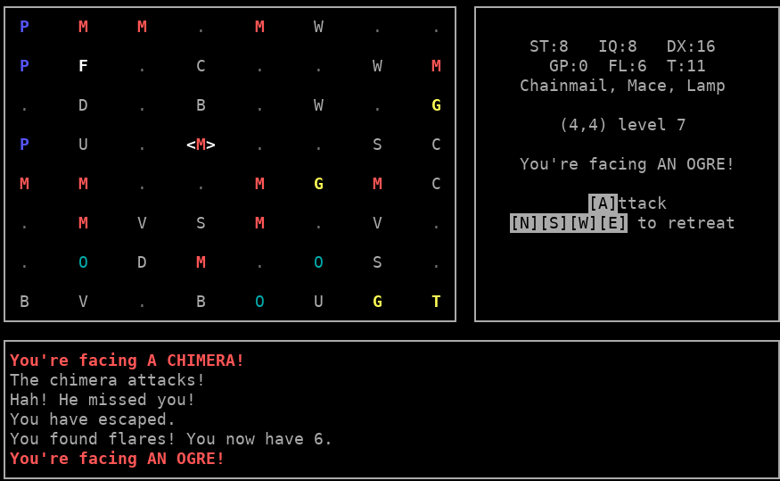

# Wizard's Castle, ncurses version

This is an ncurses front end on the [Wizard's Castle
backend](https://github.com/beejjorgensen/Wizards-Castle-Rust). (The backend
also comes with a non-curses classic version of the game.)

But this one is full of ncurses goodness:

* [More Wizard's Castle general info](https://github.com/beejjorgensen/Wizards-Castle-Info)

## TODO

* Bold on all key prompts? Or on none?

* Fix terminal resize bugs

* `refresh()` instead of `wrefresh()` to cure some repaint ills?
